# Agenda de Contactos - Proyecto de Estructura de Datos

**Agenda de Contactos** es una aplicación de escritorio desarrollada en Java y JavaFX para registrar, buscar, mostrar, eliminar, cargar y exportar contactos. El sistema usa archivos CSV como fuente de datos y comparte la misma lógica de negocio entre el modo consola y la interfaz gráfica.

---

## Descripción

El proyecto implementa una agenda de contactos con búsqueda por prefijo de nombre, apellido o apodo. Los contactos se almacenan en memoria, se indexan en un árbol de prefijos y pueden exportarse nuevamente a CSV.

La solución no usa base de datos. Los datos de prueba se encuentran en `app/contactos.csv` y `csv/contactos.csv`, y el procesamiento se realiza con clases propias para carga, búsqueda, ordenamiento y exportación.

---

## Contexto académico

Este proyecto fue desarrollado como entrega académica para la materia de Estructura de Datos. La implementación aplica programación orientada a objetos, manejo de archivos y estructuras de datos personalizadas.

| Requisito | Implementación en Agenda de Contactos |
| --- | --- |
| Aplicación de escritorio | Interfaz JavaFX con módulos de visualización, búsqueda, registro, eliminación, carga y exportación. |
| Modo consola | Menú textual para ejecutar las mismas operaciones principales. |
| Estructura personalizada | `APrefijo` para indexar contactos por prefijo. |
| Ordenamiento | `Heap` y comparadores para ordenar resultados por frecuencia o alfabéticamente. |
| Manejo de archivos | Carga y exportación de contactos desde archivos CSV. |
| Gestión de dependencias | Maven con JavaFX como dependencia principal. |

---

## Integrantes

| Integrante |
| --- |
| Karel González |
| Justin Soledispa |
| Juan Diego Sotomayor |

---

## Distribución modular

| Módulo | Responsabilidad |
| --- | --- |
| Modelo | Representa los datos de cada contacto mediante `Contacto`. |
| Agenda | Coordina el registro, búsqueda, eliminación y obtención de contactos. |
| Estructuras de datos | Implementa el árbol de prefijos `APrefijo` y el `Heap` genérico. |
| Carga de datos | Lee contactos desde archivos CSV y valida campos. |
| Exportación | Genera archivos CSV ordenados alfabéticamente. |
| Interfaz gráfica | Presenta los módulos principales con JavaFX. |
| Consola | Permite operar el sistema desde menús textuales. |

---

## Flujo general del sistema

1. El usuario ejecuta la clase principal `Proyecto.PantallaAgenda`.
2. El sistema permite elegir entre modo consola o modo gráfico.
3. En modo gráfico se abre la ventana JavaFX con un menú lateral.
4. El usuario puede cargar contactos desde `contactos.csv`.
5. La agenda registra e indexa los contactos en el árbol de prefijos.
6. El usuario puede mostrar todos los contactos registrados.
7. El usuario puede buscar contactos por prefijo de nombre, apellido o apodo.
8. El usuario puede registrar nuevos contactos desde el formulario.
9. El usuario puede buscar y eliminar contactos existentes.
10. El usuario puede exportar la agenda completa a un archivo CSV.

---

## Funcionalidades principales

* Carga de contactos desde CSV.
* Visualización completa de contactos registrados.
* Búsqueda por prefijo de nombre, apellido o apodo.
* Ordenamiento de resultados por frecuencia de coincidencia.
* Registro manual de nuevos contactos.
* Validación de nombre, apellido, teléfono y correo.
* Eliminación de contactos con confirmación.
* Exportación de la agenda a CSV.
* Ejecución en modo consola o en interfaz gráfica.

---

## Operaciones disponibles

| Operación | Disponible en consola | Disponible en JavaFX |
| --- | --- | --- |
| Mostrar contactos | Sí | Sí |
| Buscar contactos | Sí | Sí |
| Registrar contactos | Sí | Sí |
| Eliminar contactos | Sí | Sí |
| Cargar CSV | Sí | Sí |
| Exportar CSV | Sí | Sí |

---

## Stack tecnológico

| Componente | Tecnología usada |
| --- | --- |
| Lenguaje | Java 17+ |
| Interfaz gráfica | JavaFX |
| Gestión de dependencias | Maven |
| Datos | Archivos CSV |
| Paradigma | Programación orientada a objetos |
| Estructuras | Árbol de prefijos y heap genérico |
| IDE sugerido | IntelliJ IDEA |

---

## Estructura del repositorio

```text
proyecto_edd_agenda/
├── app/
│   ├── pom.xml                         # Configuración Maven del proyecto Java
│   ├── contactos.csv                   # Datos base para cargar contactos
│   └── src/
│       ├── Interfaz/
│       │   ├── AppJavaFX.java          # Inicio de la interfaz gráfica
│       │   ├── VistaBienvenida.java    # Contenedor principal y menú lateral
│       │   ├── VistaBusqueda.java      # Búsqueda por prefijo
│       │   ├── VistaCarga.java         # Carga de CSV
│       │   ├── VistaEliminacion.java   # Eliminación de contactos
│       │   ├── VistaExportacion.java   # Exportación a CSV
│       │   ├── VistaMostrar.java       # Listado de contactos
│       │   └── VistaRegistro.java      # Registro manual
│       └── Proyecto/
│           ├── Agenda.java             # Lógica central de la agenda
│           ├── APrefijo.java           # Árbol de prefijos
│           ├── CargadorDatos.java      # Carga y validación de CSV
│           ├── Contacto.java           # Modelo de contacto
│           ├── GestorAgenda.java       # Lectura y validación por consola
│           ├── Heap.java               # Heap genérico
│           ├── MenuAgenda.java         # Menú de consola
│           ├── PantallaAgenda.java     # Selector entre consola y JavaFX
│           └── ServicioExportacion.java
├── capturas/                           # Evidencia visual del funcionamiento
├── csv/
│   └── contactos.csv                   # Copia de datos de apoyo
├── docs/
│   ├── Proyecto P2 - Estructura de Datos.pdf
│   └── README - prueba.md              # Referencia de estructura documental
└── README.md                           # Documentación principal del proyecto
```

---

## Archivos CSV

El sistema espera archivos CSV con esta estructura:

```csv
Nombre,Apellido,Apodo,TelefonoMovil,TelefonoConvencional,Correo
```

Ejemplo:

```csv
Carlos,Pérez,Luapodo,0965432109,025678901,carlos.perez@email.com
```

Archivos incluidos:

| Archivo | Propósito |
| --- | --- |
| `app/contactos.csv` | Archivo principal para probar la carga desde Maven. |
| `csv/contactos.csv` | Copia de apoyo para evidencias o pruebas manuales. |

---

## Capturas del sistema

Las capturas se encuentran en la carpeta `capturas/` y documentan el flujo completo de ejecución: verificación con Maven, selector de modo, carga de datos, visualización, búsquedas, registro, eliminación, exportación y revisión del CSV generado.

### Configuración y arranque

| Verificación Maven | Selector de modo |
| --- | --- |
| 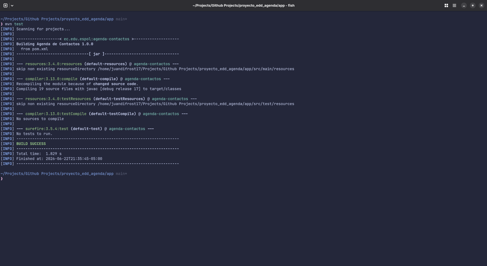 | 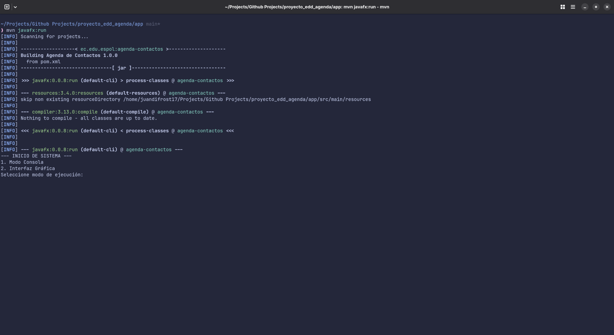 |
| El proyecto compila correctamente desde Maven con `mvn test` y finaliza con `BUILD SUCCESS`. | La aplicación se ejecuta con `mvn javafx:run` y muestra el selector inicial entre modo consola e interfaz gráfica. |

La evidencia de consola se limita al selector de modo porque el video demostrativo ya muestra el uso completo de ambas modalidades.

### Interfaz gráfica

| Pantalla inicial |
| --- |
| 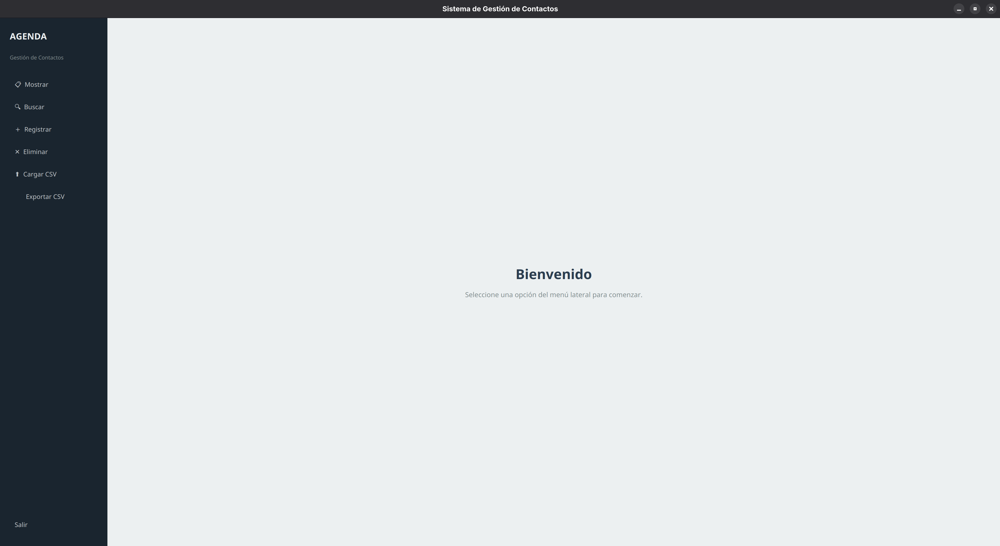 |
| Al seleccionar el modo gráfico se abre la ventana principal con el mensaje de bienvenida y el menú lateral de funcionalidades. |

### Carga de contactos

| Módulo de carga | Selector de archivo |
| --- | --- |
| 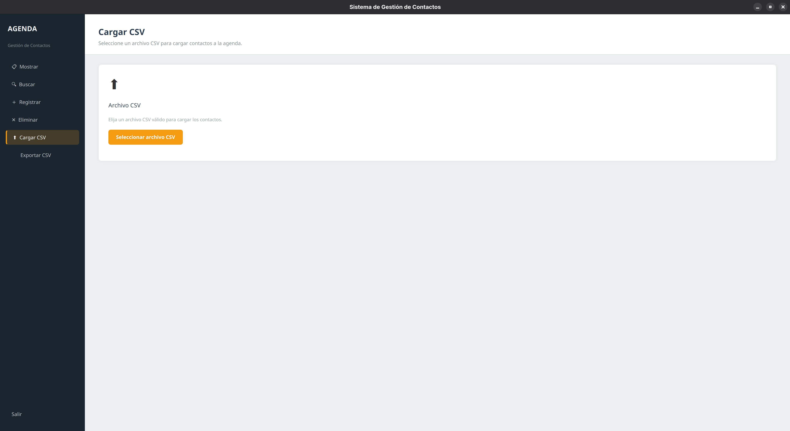 | 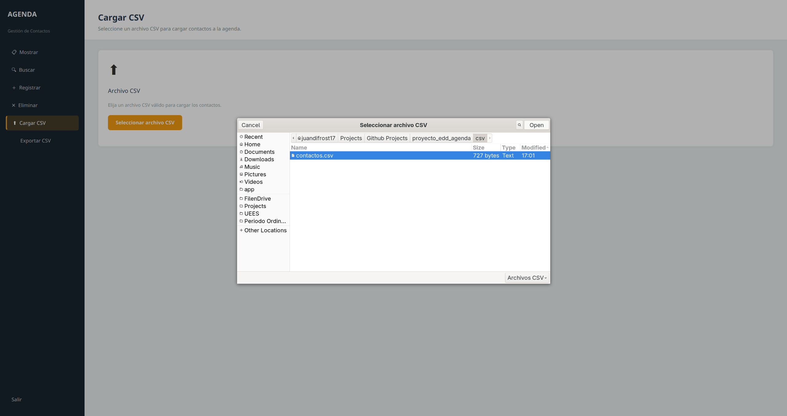 |
| El módulo `Cargar CSV` permite seleccionar un archivo externo con contactos. | El selector del sistema permite elegir `app/contactos.csv` como archivo de entrada. |

| Carga completada |
| --- |
| 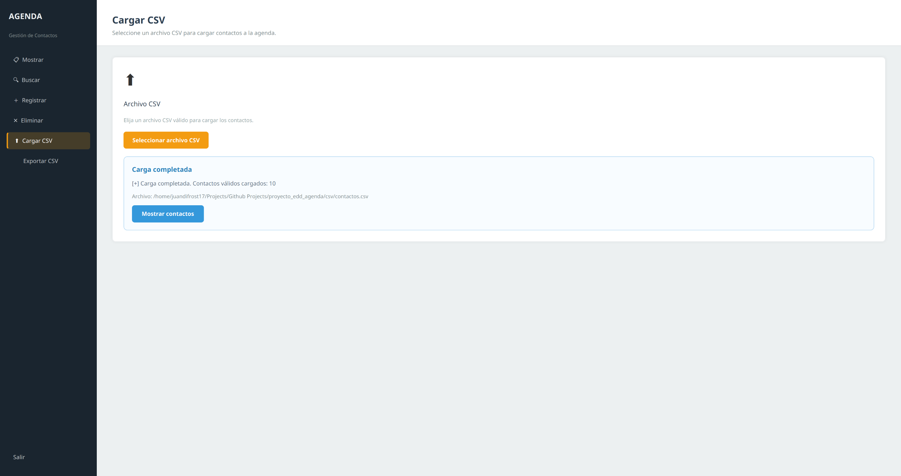 |
| Después de seleccionar el archivo, la aplicación confirma la carga y muestra la cantidad de contactos válidos agregados a la agenda. |

### Mostrar contactos

| Lista de contactos |
| --- |
| 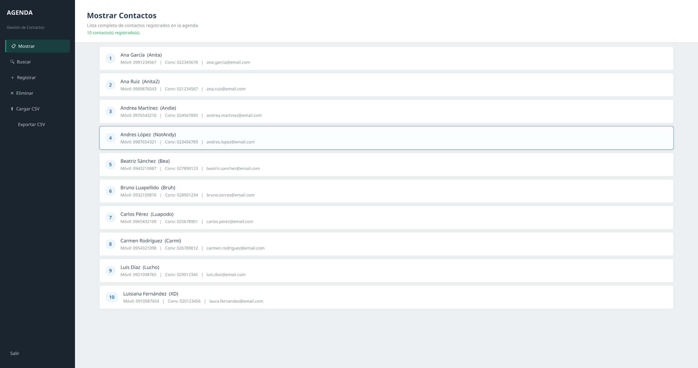 |
| El módulo `Mostrar` lista todos los contactos registrados, incluyendo nombre, apellido, apodo, teléfonos y correo. |

### Buscar contactos

El módulo de búsqueda acepta prefijos de nombre, apellido o apodo. Las capturas muestran búsquedas con prefijos que generan varios resultados y evidencian el uso del árbol de prefijos.

| Búsqueda por prefijo `Lu` | Búsqueda por prefijo `An` |
| --- | --- |
| 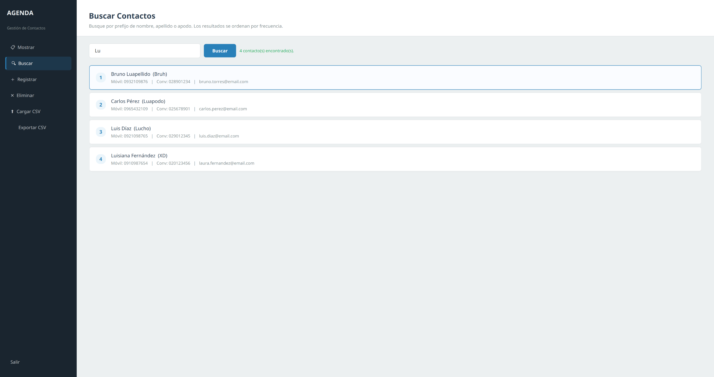 | 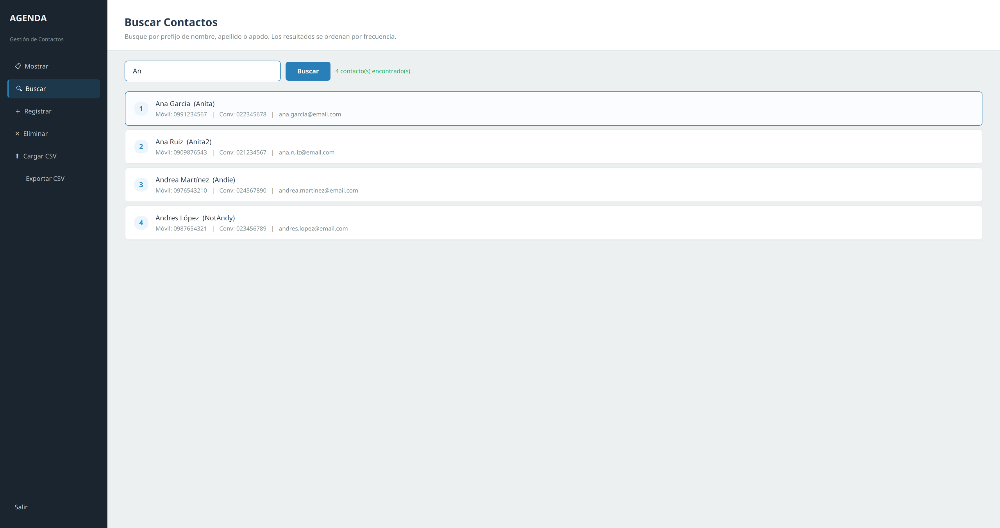 |
| Con el prefijo `Lu`, aparecen coincidencias como `Luapellido`, `Luapodo`, `Luis`, `Lucho` y `Luisiana`. | Con el prefijo `An`, aparecen contactos como `Ana`, `Andrea` y `Andres`. |

| Búsqueda con orden actualizado |
| --- |
| 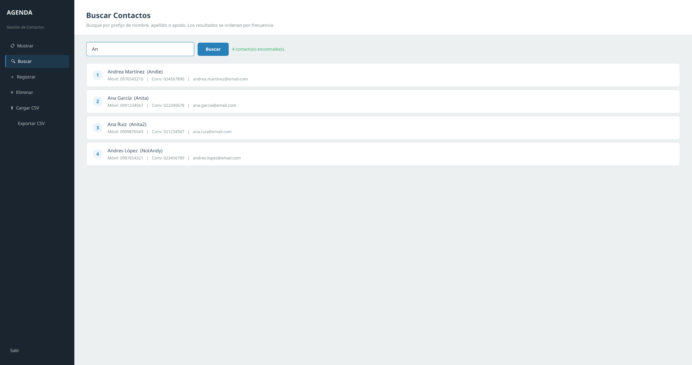 |
| Al repetir búsquedas, los resultados pueden reorganizarse según la frecuencia usada por el comparador de resultados. |

Campos a llenar:

| Campo | Ejemplo |
| --- | --- |
| Prefijo | `Lu` |
| Prefijo alternativo | `An` |

### Registrar contacto

| Formulario de registro | Registro confirmado |
| --- | --- |
| 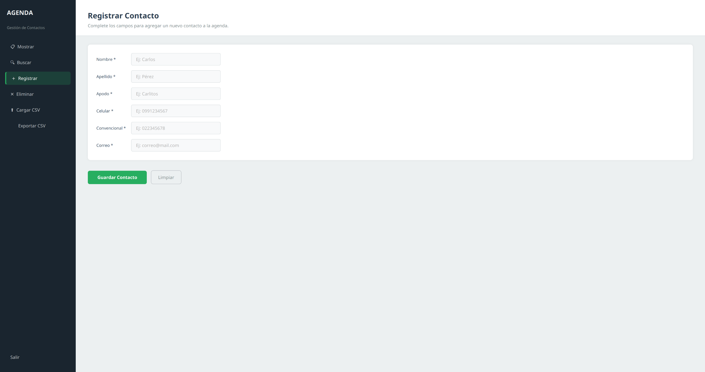 | 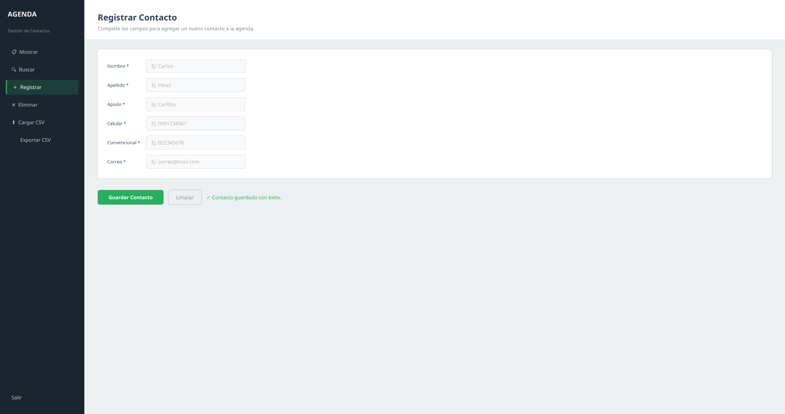 |
| El módulo `Registrar` muestra campos para nombre, apellido, apodo, celular, teléfono convencional y correo. | Después de validar los datos, la aplicación confirma que el contacto fue guardado con éxito. |

| Formulario completado |
| --- |
| 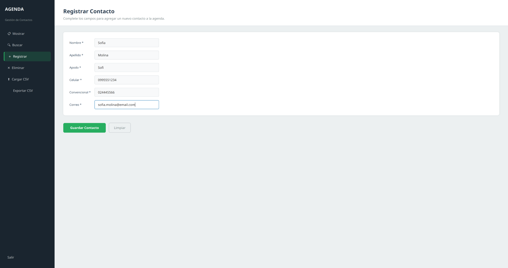 |
| La captura muestra un contacto de prueba antes de guardarlo en la agenda. |

Datos sugeridos para llenar:

| Campo | Valor |
| --- | --- |
| Nombre | `Sofia` |
| Apellido | `Molina` |
| Apodo | `Sofi` |
| Celular | `0995551234` |
| Convencional | `024445566` |
| Correo | `sofia.molina@email.com` |

Después de guardar, puede ir a `Buscar` y usar el prefijo `Sof` para comprobar que el contacto fue indexado.

### Eliminar contacto

| Búsqueda para eliminar | Confirmación de eliminación |
| --- | --- |
| 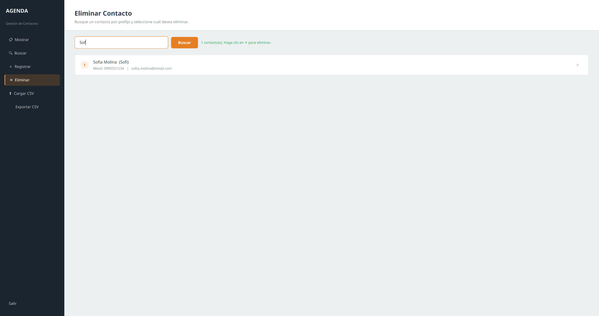 | 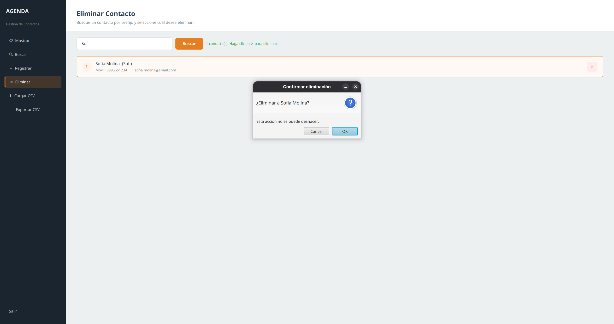 |
| El módulo `Eliminar` busca contactos por prefijo y muestra el botón `✕` para seleccionar el registro que se desea borrar. | Antes de eliminar, la aplicación muestra una alerta de confirmación para evitar borrados accidentales. |

| Eliminación aplicada |
| --- |
| 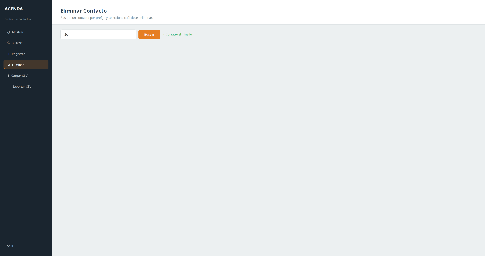 |
| Luego de aceptar la confirmación, el contacto deja de aparecer en los resultados de búsqueda. |

Ejemplo recomendado:

| Campo | Valor |
| --- | --- |
| Nombre, apellido o apodo | `Sof` |

Use `Sof` si primero registró el contacto de prueba. Así evita eliminar datos originales del CSV.

### Exportar agenda

| Pantalla de exportación | Exportación confirmada |
| --- | --- |
| 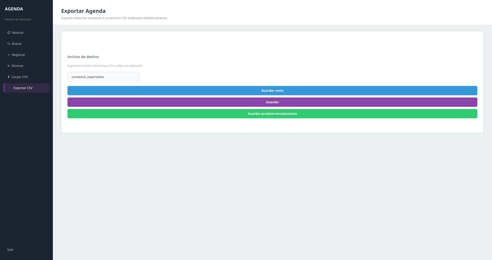 | 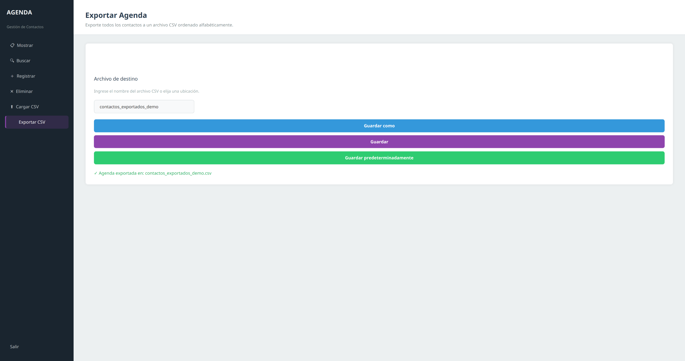 |
| El módulo `Exportar CSV` permite escribir un nombre de archivo, elegir una ubicación o guardar en la ruta predeterminada. | Después de guardar, la interfaz confirma la ruta del archivo CSV generado. |

Campos a llenar:

| Campo | Valor |
| --- | --- |
| Archivo de destino | `contactos_exportados_demo` |

El sistema agregará automáticamente la extensión `.csv` si no se escribe.

### Archivo exportado

| CSV exportado |
| --- |
| 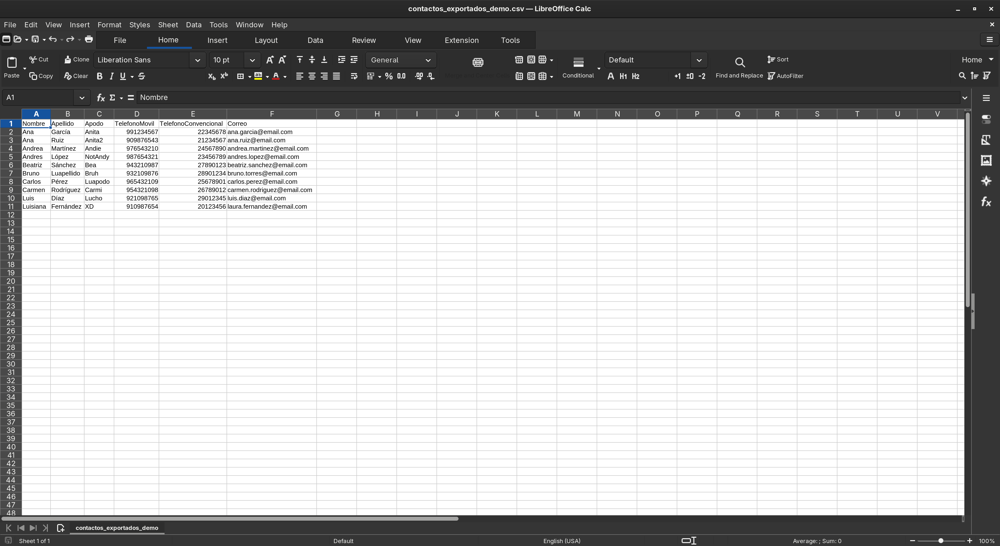 |
| El archivo exportado puede abrirse en LibreOffice Calc, Excel o un editor de texto. La evidencia muestra las columnas `Nombre`, `Apellido`, `Apodo`, `TelefonoMovil`, `TelefonoConvencional` y `Correo`. |

---

## Video demostrativo

[Ver video en Google Drive](https://drive.google.com/file/d/1pkAjwHis2M52pK_sd8N4e11F7yS_xJBv/view?usp=drive_link)

---

## Instalación y ejecución

### Prerrequisitos

* JDK 17 o superior.
* Maven.
* Git, si se clona el repositorio.

### Clonar el repositorio

```bash
git clone https://github.com/juandifrost17/proyecto_edd_agenda.git
cd proyecto_edd_agenda/app
```

### Verificar compilación con Maven

Desde la carpeta `app`:

```bash
mvn test
```

La verificación debe terminar con:

```text
BUILD SUCCESS
```

### Ejecutar la aplicación

Desde la carpeta `app`:

```bash
mvn javafx:run
```

La aplicación mostrará el selector inicial:

```text
--- INICIO DE SISTEMA ---
1. Modo Consola
2. Interfaz Gráfica
Seleccione modo de ejecución:
```

Seleccione `1` para usar el menú en terminal o `2` para abrir la interfaz JavaFX.

### Ejecutar desde IntelliJ IDEA

1. Abrir IntelliJ IDEA.
2. Seleccionar `Open` y abrir el archivo `app/pom.xml`.
3. Esperar la importación de Maven.
4. Crear una configuración `Application`.
5. Usar como clase principal `Proyecto.PantallaAgenda`.
6. Configurar el directorio de trabajo como `app`.
7. Ejecutar la configuración.
